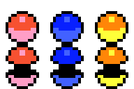

# 原版捕获精灵球素材

四个球条目已换为固定 Crystal 提交 `7a7881d0d62e0ddbd82dcf10e7116807487ac651` 的 [pokeball.png](https://github.com/pret/pokecrystal/blob/7a7881d0d62e0ddbd82dcf10e7116807487ac651/gfx/battle_anims/pokeball.png)。原作三种球共用球体点阵，由 [BallColors](https://github.com/pret/pokecrystal/blob/7a7881d0d62e0ddbd82dcf10e7116807487ac651/data/battle_anims/ball_colors.asm) 选红、蓝、黄的 [原版战斗配色](https://github.com/pret/pokecrystal/blob/7a7881d0d62e0ddbd82dcf10e7116807487ac651/gfx/battle_anims/battle_anims.pal)，没有额外绘制条纹。

完整 16×16 原帧整数放大为 32×32，UIA1 格式与条目名不变。闭球的可见边界是 `{4,8,24,24}`；开球是 `{4,0,24,32}`。`ball_open` 把源图中的顶/底两片按原 PNG 排列合成，仅作为静态打开状态素材，不声称复现捕获动画的时序与运动。

固件接线使用生成的 `ball_assets.h`：`ball_assets_palette(kind)` 返回精灵球、超级球、高级球原版 RGB565；`ball_assets_visible(opened)` 返回可见边界。UI 数据已包含 2 倍放大，绘制时 scale=1。Inspector 的球图、配色和字节预算均来自实际 UI 数据。成功应保持闭球，页面由捕获任务接线。

核验结果：

- 独立 Pillow 解码 PNG，编译原版 `tools/gfx.c` 执行 `--remove-xflip --keep-whitespace`，再依据 OAMSET_0A/0C/0D 重建两帧；512 个原生像素零差异。
- 4 项 UI 位图及三种原版配色零差异；其余 5 项 UI（含 Oak）与改动前逐字节相同。
- 实际 `assets.c + render.c + screen.c + ball_assets.h` 绘制 3 球种 × 2 状态，460,800 个屏幕像素零差异，ASan/UBSan 通过。
- `verify_ui.py` 和 `fetch_balls.py --check` 通过。源哈希与选择依据见 `assets/ball_sources.json`；机器结果见 [result.json](evidence/balls-original-2026-09-07/result.json)。

下图来自实际 C 渲染，展示顺序为精灵球、超级球、高级球；上行为闭合，下行为打开。

