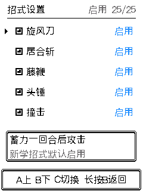
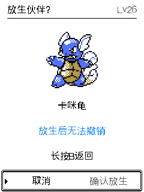

# 仓库放生与招式设置验证（2026-10-07）

本次在已有招式设置基础上补齐仓库管理。队伍伙伴详情的「仓库」可进入仓库，选中个体后有换入、技能、放生三项。放生不必先换入队伍；二次确认默认取消，显示名字、等级和闪光提醒，长按 B 可取消。新增等级从低到高排序，仅调整展示顺序，不改变存档内的个体位置。

放生通过物理仓库槽位与所显示个体校验，保存成功后才发布删除，保存失败保留伙伴与招式策略。放生会清除该个体的禁用招式，保留其他个体、图鉴和成就历史。进行中的对战及秘境锁定期间不允许删除；单只操作，不提供批量放生。

## 存档边界

放生不再增加持久化字段，仍为前一项招式设置功能引入的 V21。相对目前公开 V20 固件，本次烧录包含 V20→V21：追加每个队伍/仓库个体的招式禁用策略，历史个体默认全启用。仍支持 V5～V21；历史固定样本未改写，旧格式通过相同启动/导入迁移路径。不能把 V21 备份导入不支持它的旧固件。网页及离线工具协议无需调整，开发 restore.py 的同设备同构建限制保留。

## 自动化验证

AGENTS.md 的 11 项备份、导入、历史迁移、真实 ESP-IDF NVS 恢复、分发、分区、地区和秘境栈检查通过，ESP32-C3 固件构建通过。另通过招式设置逻辑、界面、秘境三项，以及仓库放生逻辑/界面、151 槽位仓库浏览回归，共 17 项脚本。仓库浏览测试原先把排序写死为两项，已更新为三项并重新通过。

放生生产代码测试覆盖 NVS 打开/写入/提交失败、重启持久化、陈旧选择、同种普通/闪光个体隔离、队伍和历史记录不变、清空仓库及战斗锁。UI 使用真实 LCD 渲染和 A/B/C 事件，通过 69 次整屏/横带一致性检查，验证默认取消、长按返回、失败重试、闪光提示和排序。

完整招式设置验证见 [招式设置记录](move-settings-2026-10-07.md)。检查清单见 [checks.json](evidence/box-release-2026-10-07/checks.json)。设备验证见下文；上述自动化不代表已覆盖导入玩家唯一存档。

## 真机发现的 NVS 容量问题及修复

首次烧录后的真实手动存盘返回 `ESP_ERR_NVS_NOT_ENOUGH_SPACE`。应用写入与受保护分区核对已成功，原始私人备份保留。此前自动化虽然包含满仓库/招式策略/秘境，但没有设备经历多次升级后的实际碎片布局，不能代替真机容量验证。

将设备原始 NVS 只读复制到隔离 RAM Flash 后，用真实 ESP-IDF NVS 复现连续写入失败；验证保留有效 run_v3、清除早已被其取代的 run_v1 后，连续 300 次保存通过。固件现在仅在最新可读秘境记录通过完整校验时，清理更旧版本的 run 键；run_v4 写入成功后再清理其旧格式。保留键不先删除，校验失败/截断/较新记录损坏/未完成的旧租借记录均不触发清理，不改变世界进度及存档版本。

真实 NVS 回归补入射频校准数据、旧秘境键和 8 个清理场景，覆盖 V2/V3/V4 保留、损坏拒绝、只有未知旧记录、清理写入失败后重新挂载。实际私有备份仅用于本地测试，不提交。修复后重新运行全部 17 项检查通过；最终真机连续保存结果见下文。

## 最终设备交付

最终固件来自 `4b614e7c8c90529f261fc9ca729774807b6f29e3`，3184576 字节，SHA-256 `c1fb6b84a8024fc6560c5c0c2cdeaa6d8b7c877c9d44d255eb021f22c8673636`。只写应用地址 0x10000，经过更新前私人备份、写盘回读、应用校验和所有受保护分区逐字节核对后启动；未写完整安装镜像。原始及修复前后的备份留在 `.device-backup/box-release-20261007/`，没有提交。

修复版在设备上连续手动保存 8 次全部成功；再次重启后读档与手动保存成功，无空间不足或 panic。妙蛙花 Lv44 / 132672 经验、图鉴 107、队伍 6 / 总伙伴 100、秘境 run1/node4/phase6 均保留，静音保持。按生产结构偏移对升级前 V20 与升级后 V21 的真实 NVS 存档比较，队伍/仓库完整序列、图鉴、背包、挑战、成就、探索、地区和秘境字段逐字节相同；新招式策略全部启用，当前 run_v3 原始数据不变，过期 run_v1 已移除。

真机打开了招式设置与仓库放生确认页，并取消返回；没有放生玩家真实伙伴。功能的成功放生、保存失败与个体隔离使用隔离样例验证。本轮完成的是应用保档升级及启动迁移，未在玩家唯一存档上执行覆盖导入；覆盖导入、回滚和历史兼容由隔离真实 NVS 回归验证。需要安装新固件才能获得功能，网页和离线工具协议未改变。

本次仅本地开发、验证及烧录，未推送或发布社区版本。详情见 [固件摘要](evidence/box-release-2026-10-07/build.json) 与 [设备核对](evidence/box-release-2026-10-07/device.json)。

