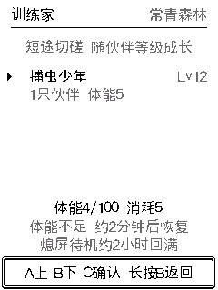
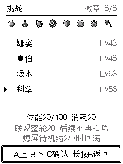
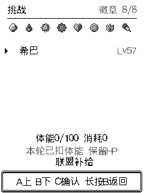
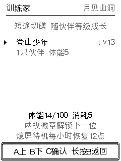

# 挑战体能与日常节奏

重复训练与全局体能联动，保留探索机会作为外出积累的资源。队伍所有成员共享体能，战斗中的每只宝可梦 HP 仍独立。

## 已实现规则

| 行动 | 消耗 |
|---|---|
| 普通探索 | 5 点体能＋1 次探索机会，保持原规则 |
| 路线训练家切磋 | 每场 5 点体能，不扣探索机会 |
| 道馆、强化重赛、赤红 | 每场 10 点体能 |
| 四天王与冠军 | 整轮 20 点，科拿入场扣一次，后续四场不再扣 |
| 已发现野怪战斗、捕捉 | 无新增入场费用 |
| 查看图鉴、队伍、菜单、研究与领奖 | 无新增体能费用 |

体能上限 100，设备开机或熄屏待机每小时恢复 12 点。5 点约需 25 分钟恢复。页面显示实际可用的整点余额，4.9 点显示 4，避免显示够用却不能入场；养成计算和扣除继续保留 Q10 小数精度。

挑战大厅显示余额、当前选择的费用、约需多少分钟恢复以及熄屏待机说明。联盟首场明确标注整轮收费，后续关卡显示消耗 0，并保留联盟补给入口。未解锁的训练家继续隐藏。

认输不退入场体能。训练家战败仅额外扣 5 点心情，不再追加扣 20 点体能；不扣经验。野战原有败战后果不变。饱食与心情仍可影响战斗能力，低体能不再触发消沉或降低伤害。

## 保存与恢复

开战和扣费位于同一个候选存档中，提交成功后才发布。写失败不扣费、不进入战斗；连续确认、重启续战、反复结算均不重复收费。NVS 写入期间发生的正常体能恢复保留。联盟通过现有持久化进度识别已付费的后续关卡，失败或认输结束整轮，下次从科拿重新付费。

存档保持 V14 / 3664 字节，无格式迁移。升级时已经在进行的挑战继续原会话，不追溯扣入场费用。没有增加领取奖励或退出再进入的回体能入口。

## 验证

- [实际世界与存档](evidence/challenge-stamina-2026-09-10/transactions.json)：110 项检查，运行实际 world/save/trainer/nurture C 与 ASan/UBSan。覆盖四种入口、差一个 Q10 单位、恰好够用、锁定/非法挑战、NVS 三类写失败、重复确认、重启、整轮联盟、退出后重开、胜败奖励、重复结算、并发恢复和恢复上限。
- [页面与手势](evidence/challenge-stamina-2026-09-10/ui.json)：268 次局部/全屏像素比对。覆盖余额/费用/等待提示、存档失败重试、认输、败战心情、联盟后续免费、4.8 点不显示 5、熄屏待机恢复及唤醒键不误开战。
- [原有导航回归](evidence/challenge-stamina-2026-09-10/navigation/navigation.json)：10 组流程、820 次像素比对，包含低体能照料、仓库、野战/捕获和训练家战术。
- [经验与学习提示回归](evidence/challenge-stamina-2026-09-10/growth/growth-ui.json)：143 次像素比对；经验条、多招式分页、六名队员通知和关闭时输入隔离均通过。
- [养成对账](evidence/challenge-stamina-2026-09-10/nurture.txt)：3201 拍时间推进、40 步照料、6 步混合序列通过。
- ESP-IDF 5.5.3 构建通过；同源预览构建 `03c9c1ba321fecfa31f8`。浏览器载入并检查费用提示；音频试听保持关闭。

## 设备更新

已备份当前数据与应用 `0x9000..0x310000`，并保留此前完整 8MB 备份；只烧录 `factory` 应用地址 `0x10000`，esptool 校验通过。NVS、cardid、recovery 未被覆盖。应用大小 2,996,912 字节，SHA256 `dc28802a1c26720af4c4934acc8891f56a5329ff01cecf886a4418fb419957da`。见[安装回执](evidence/challenge-stamina-2026-09-10/hardware-install.json)。

[真机导航验证](evidence/challenge-stamina-2026-09-10/device-navigation.json)覆盖主页、菜单、道馆、探索、活动、路线训练家与逐级返回，共 10 次状态检查，直接读取 LCD 像素核对费用提示。只浏览页面，没有消耗体能、道具或注入经验；设备继续保持妙蛙种子 Lv15、经验 5620，已返回主页。实际扣费、失败重试及完整联盟在生产 C 的隔离存档环境验证。

## 尚未实现：真正关机后的恢复

当前运行时使用开机微秒计时，读档时重置养成的时间基准。板级驱动接入显示、按键、音频和电量计，未接入可用的断电保持时钟；Wi-Fi 只扫描环境，没有连接网络校时。因此无法可靠获知完全关机的时长，本次没有实现关机期间的补算。

熄屏仍然运行后台养成，已验证可恢复。真正关机恢复需要增加可靠的绝对时间来源及持久化时间戳，例如接入保持供电的 RTC，或在恢复连接后通过网络/配套设备校时；还需处理时钟回退、重启重复补算和老存档迁移。此次未修改电源按钮行为。
