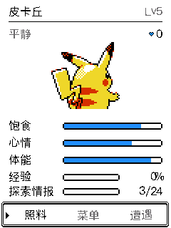
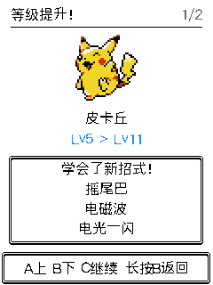
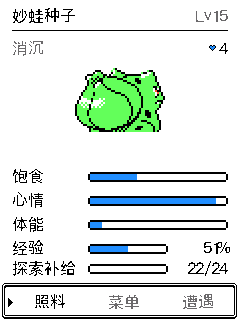

# 经验条、统一按键与升级提示 · 2026-09-10

## 最终行为

- 主页经验条恢复，与探索补给分两行显示。显示当前等级经验百分比，Lv100 显示满条和「满级」。保留探索补给的次数与增长反馈，两条进度条的左边缘与养成数值对齐。
- 取消按列表长度切换操作：全部使用 A 上、B 下、C 确认，长按 B 返回。主页、两项确认框、三只队伍、探索活动等也使用光标。捕获中 A/B 换球，按下 C 即刻投球；长按 B 返回。
- C 在开场推进对话、在训练家战斗打开战术菜单，不再直接跳过或认输。逃跑/认输需要长按 B 或选中相应动作，再在确认框中选择并确认。
- 升级显示正面宝可梦、等级变化、新学会的招式和升级音效；保持静音设置。多招式分页，每页三招，A/B 翻页、C 继续、长按 B 关闭。招式仍由完整等级学习表自动计算，无需学习操作、遗忘或 PP。
- 主宠和分享经验的队员都会提示；一次跨越多级会包含整个区间的新招式。野战经验动画、捕获流程、道馆获胜对话及奖励展示完成后再显示，不抢占这些过渡。

## 实现边界

升级事件只保存用于展示的种类、等级范围、队伍位置与闪光信息；经验和招式可用性仍由原世界状态和战斗模块决定。捕获、战斗胜败、探索发现、研究结算在保存成功后记录事件，失败或重复结算不产生事件，换宠也不误报升级。

通知队列仅存于内存，重启不补播已积压的提示；已保存的等级和招式不受影响。存档仍为 V14 / 3664 字节，无格式迁移。

通知使用最终绘制层，和设备输出、Web 预览、截图共享同一套像素代码。关闭提示不重建原页面，也不会把同一次 C 确认传给原页面。

## 验证

- [导航](evidence/controls-growth-2026-09-10/navigation.json)：10 组流程、820 次局部/全屏重绘比对通过，包括小列表、捕获反击、逃跑确认、训练家换宠和低体能照料。
- [投球](evidence/controls-growth-2026-09-10/capture-timing.json)：306 组时机检查通过；C 按下投球、松开不重复投球，覆盖保存延迟和区外失败。
- [实际世界与存档](evidence/controls-growth-2026-09-10/growth-save.json)：26 个检查通过，运行 ASan/UBSan；覆盖失败写入、胜败/捕获/研究奖励、队员分享、重试和换宠。
- [升级 UI](evidence/controls-growth-2026-09-10/growth-ui.json)：143 次局部/全屏比对通过；验证经验条独立更新、满级、宝可梦图像存在、五招分页、六只队员通知、道馆对话先于通知、关闭不误触。
- [HTTP](evidence/controls-growth-2026-09-10/http-input.json)：20 帧同源输入比对通过；[浏览器手势](evidence/controls-growth-2026-09-10/web-input.json)验证长按后不产生短按及事件队列顺序。
- ESP-IDF 5.5.3 构建通过。

## 设备安装

已备份当前数据及应用（`0x9000..0x310000`），仅烧录 `factory` 应用到 `0x10000`，esptool 哈希校验通过；NVS/cardid/recovery 未写入。程序大小 2,995,520 字节，SHA256 `40e29e189949e6dc98a81a5828ca58a651e587cf98a75af4797b907dfeedff2b`。[安装记录](evidence/controls-growth-2026-09-10/hardware-install.json)。

[真机导航](evidence/controls-growth-2026-09-10/device-navigation.json)经串口进入实际按键分发器，确认 A/B 只移动光标，C 进入菜单、图鉴、照料和遭遇列表，长按 B 逐级返回。直接读取设备像素确认经验条为 51%、探索补给 22/24。

烧录前后妙蛙种子均为 Lv15、经验 5620，验证未消耗道具或修改进度。新招式提示已在同源 C 环境验证；没有为了真机截图人为增加存档经验。设备与浏览器已返回主页。

