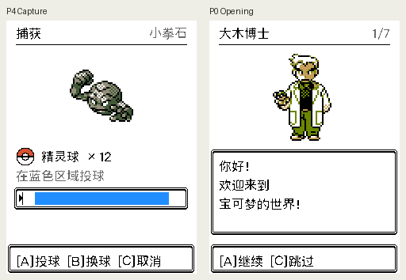

# 捕获蓝条与彩色大木博士

捕获判定框的原版 frame 1 图块上下墨线位置不对称。蓝条原为 y216–231，内侧留白上 1px、下 3px；现调整为 y217–232，上下均 2px。判定窗口宽度、指针横坐标、投球结果保持原逻辑，三种球的像素间距与完整重绘均已核对。

大木博士改用固定 Crystal 提交的原版开场立绘与配色，保留全部原始色阶和白大褂。素材来源与核验信息见 [Oak 审计](../../oak-color-2026-09-07.md)。

最终 native 构建 `f9ee0c79a1bf99b90099`：848 次全页横带重绘、65536 种线缆颜色解码和 2 个反向验证通过；P0/P4 实际浏览器的 153600 像素与独立 native 帧哈希一致。Inspector 已重建并通过新鲜度门禁，ESP32-C3 构建通过。应用容量不变，保留既有 recovery 分区过小警告；没有刷写设备。

