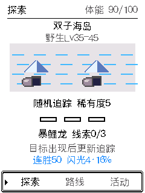
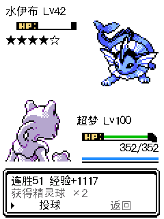

# 探索补给、地区难度与闪光连胜（2026-10-06）

本轮已实现并完成本地验证，尚未烧录、推送或社区发布。固件源码见 `23a7a71`；存档布局来源固定在 `0448424`，用于新增 V19 历史样本。

## 反馈与改动

### 补给不再集中到球类

旧版普通战利品分支有 75% 概率给精灵球，特殊分支也偏向球类；新地图深层线索完全不给道具。现在：

- 野生战斗仍有基础补给，重新分配球类、照料类和进化道具权重。每个星级各抽样 10 万次，球类约占 26.3%–30.4%，照料类约占 49.9%–70.5%，其中树果约占 25.2%–39.0%。这是掉落次数分布，背包容量处理前的统计，不是每场必给食物。
- 所有地图的线索事件都提供补给，常规与深层一致。基础选择为树果 45%、牛奶 20%、能量根 5%、亲密饼干 5%、地区/剧情道具 25%；如果地区道具本身是食物，食物实际占比会更高。树果一般一次两颗。
- 抽中的道具已经满堆时，转为尚有空间、库存比例较低的基础补给，不通过溢出额外制造大师球或进化石。只有全部备选也满时才不发放；部分可收取时只补满剩余容量，并显示实际数量。
- 训练家切磋每次补给调整为两颗树果和一瓶牛奶，保留球类与既有首胜奖励。
- 道具编号、容量、使用效果和成就领取语义没有改变。

### 地图最低等级与难度

上一版源码已经将八个新地图改成固定等级区间（`68ffedd`），但上一轮发布没有把该版烧录到设备。海岛本身最低为 35，因此看到 35/36 不足以判断算法失效。本轮增加“野生 Lv”提示，验证遭遇生成、进入对战和切换主宠后均保持已生成等级。

| 地图 | 常规野生等级 | 深层野生等级 |
| --- | --- | --- |
| 双子海岛 | 35–45 | 40–45 |
| 幽灵高塔 | 42–55 | 49–55 |
| 野生原野 | 38–50 | 44–50 |
| 磁轨矿坑 | 45–58 | 52–58 |
| 火山遗迹 | 48–60 | 54–60 |
| 龙息山谷 | 50–65 | 58–65 |
| 无人研究所 | 60–75 | 68–75 |
| 白银雪岭 | 65–85 | 75–85 |

四条初期路线保留随主宠成长的设计，同时增加最低等级：森林 2、山洞 8、浅滩 12、电站 18。新地图不随主宠等级降低；旧列表里已生成的遭遇保持原等级，不重抽。

### 修正四星过密

旧新地图的基础四星以上权重为常规 40%、深层 65%。当某条路线缺少二/三星候选，旧算法还会将剩余权重重新归一化，进一步放大稀有概率；雪岭峰顶路线更是全部为高星。

现在基础权重为常规四星 12%、五星 2%，深层四星 22%、五星 4%。缺失档位优先向较低档分配，普通档抽签不能因为候选正在列表里就升级成稀有档；峰顶加入原地区池内的海刺龙和呆壳兽。24 条分支分别覆盖常规与深层抽样，未出现旧版因缺档放大到 70%–100% 的问题。

追踪三条线索后出现目标的机制保留；地区非稀有随机遭遇最多连续九次，下一次随机遭遇保底四星以上，追踪到高星也会重置计数。因此 14%/26% 是基础随机概率，不代表包含追踪和保底后的总占比。修复了旧基础路线追踪时，将目标自身星级按随机骰子“抬星”的问题。

### 单独计算探索连胜

- 地图探索和徽章探索活动中的单宠野生战斗，获胜增加一次。只有这些遭遇中己方倒下才清零。
- 切换页面、地图、伙伴、关机重启都保留；捕获和逃跑不增加、不清零。
- 被动遭遇、秘境通关伙伴、训练家、道馆、联盟和秘境内战斗均不改变探索连胜。
- 胜利与经验在同一次存档事务内结算，失败重试不会重复增加；探索战败与惩罚在同一次事务内清零。
- 闪光只在新遭遇生成时计算，与星级无关；已生成的伙伴不会因查看、换地图或连胜变化重新抽取。

设连续胜利次数为 `n`，来源基础闪光分母为 `d`，总概率为 `(n+48)/(n+48*d)`。普通探索 `d=48`，徽章活动 `d=32`。实现保留原基础骰子，再使用独立奖金骰子；概率持续增长，没有固定的连胜奖励阶段上限，也不会提供必定闪光。计数达到 uint32 上限时饱和，禁止溢出回到零。

普通探索约为：0 连胜 2.08%，50 连胜 4.16%，100 连胜 6.16%，200 连胜 9.90%。界面百分比向下显示到小数点后两位。探索页显示连胜与闪光率，战斗结算显示连胜变化，活动菜单增加规则说明。

## 存档、备份与安装

- 存档 V18（4008 字节）升级为 V19（4016 字节），完整保留 V18 前缀和尾部填充，末尾新增明确的 `exploration_wins` 字段。NVS 键、分区、队伍结构、道具编号、独立秘境 V4 均不变。
- V19 显式定义遭遇来源值 9 为地图探索，原来的 1–8 仍为徽章活动，0 仍为普通/被动/秘境奖励来源。V18 及以前继续拒绝超出其定义范围的值；V18 稀有保底字段也保留旧有效性边界，不因本轮延长保底而放宽历史损坏检测。
- 支持 V5–V19。V5–V18 迁移后连胜为 0，其余有效进度保留。旧版普通遭遇没有可靠来源标记，不追认连勝资格；更新后新生成的探索遭遇会带来源标记，既有徽章活动仍可识别。
- 历史样本只追加 `v18-68ffedd.bin`、`v19-0448424.bin`；原先 19 份样本未覆盖、重生成或删除。新增 V19 样本同时含连胜数与新的探索来源值。
- 启动读档与 USB 导入仍共用解码与校验，保留同设备、分区、CRC/SHA、文件声明版本、覆盖前备份 ACK、设备确认、目标构建恢复日志、断电恢复与写失败回滚保护。命令行直接写 Flash 的同构建限制未删除。
- 功能生效需要升级固件。当前在线网页和当前离线工具的动态版本协议已通过 V19 检查，本轮没有修改其资源或 ZIP，无需新部署。更早的固定版本限制工具不在此承诺范围内。
- 完整社区安装包仍可能擦除 NVS，不能当作保档更新；实际发布时应先备份，选择分区匹配的应用更新包，必要时通过网页恢复。新 V19 备份不能倒灌到最高支持 V18 的固件。

## 验证与交付边界

- AGENTS.md 列出的 11 项存档/更新/地区/栈检查全部通过，固件构建通过。
- 额外通过探索活动、探索平衡与独立连携检查；故障注入覆盖保存失败、重试、不重复结算、重启、其他对战隔离，以及最大计数不回绕。
- 道具事务套件 102 项通过，含旧档、掉落容量、使用失败、重复领取保护和 50 万次分布抽样。原测试构建缺少新依赖已补齐；道具进化规则对照固定上游提交 `7a7881d0d62e0ddbd82dcf10e7116807487ac651`。
- 21 份固定存档样本通过启动迁移与真实 ESP-IDF NVS 导入：后者在隔离的 RAM Flash 上运行实际 NVS、暂存、恢复日志、重启读档和回滚逻辑，不是硬件覆盖测试。
- 24 条路线常规/深层预览共 456 项检查；完整探索胜败预览 91 项检查。42 级遭遇进入战斗仍为 42 级，探索胜利 50→51，探索战败 50→0；分带与整屏渲染像素一致。
- 新增平衡回归已接入固件 CI 工作流，但本轮尚未推送，未执行新的远端 CI。未烧录、未用真机覆盖导入玩家存档、未提交社区审核。
- 最终固件源提交、构建版本、大小和 SHA-256 见 [build.json](evidence/exploration-balance-2026-10-06/build.json)。检查结果见 [checks.json](evidence/exploration-balance-2026-10-06/checks.json)、[items.json](evidence/exploration-balance-2026-10-06/items.json)、[chain-preview.json](evidence/exploration-balance-2026-10-06/chain-preview.json)。
