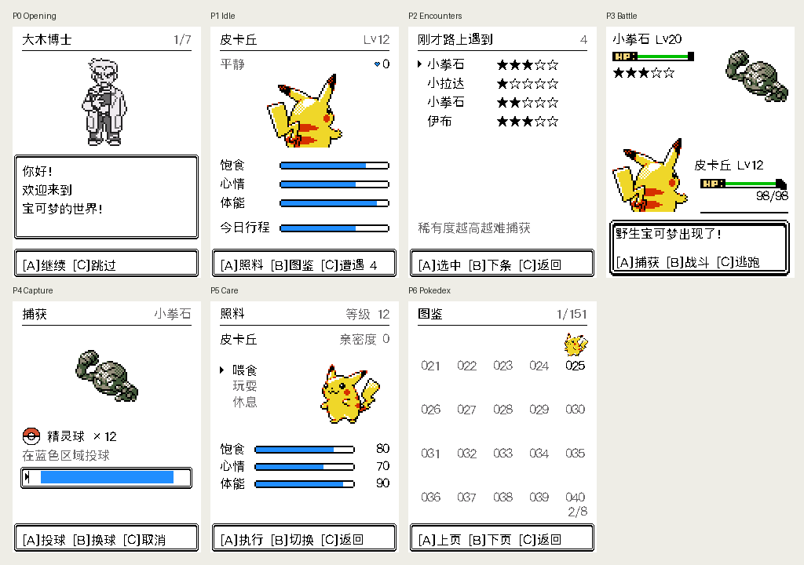

# 金银页面风格与 151 种正背图验收

本轮将 P0 开场、P1 待机、P2 遭遇、P4 捕获、P5 照料、P6 图鉴统一到 P3 对战的白底、黑色原版像素框与文字风格。标题、数值、条目和底部三键区使用统一对齐规则；照料与图鉴展示正面，待机与对战主宠展示完整背面。

## 素材结论

按金银／水晶的方向，当前采用固定 `pret/pokecrystal` 提交的 151 张正面首帧、151 张 48px 背图及原版普通／闪光配色。旧 RBY 产物全部 302 张存在内部白被改浅色的问题，共 53,510 个源像素；新转换保留原始四种色阶。详细来源、逐图计数、调色板映射、独立 oracle 方法见 [素材审计](pokemon-art-audit-2026-09-07.md)。玩法数据除配色索引外逐字节保持一致。

## 验证结果

最终 native 构建：`41d2c15b14d213e7cd94`。所有以下检查已实际执行。

| 检查 | 结果 |
|---|---|
| 原始正背 PNG 与打包像素 | 302 张、709,440 源像素，0 差异 |
| 原版普通／闪光配色 | 各 151 种，0 差异；覆盖 7 个反序例外、最高组合索引 291 |
| 真实资产读取 + render.c + screen.c | 604 次渲染、46,387,200 屏幕像素，0 差异；ASan/UBSan 通过 |
| 实际 P3 中 151 种野怪 | 2,355,600 ROI 像素一致，661,080 实体缩放像素完整保留 |
| 全页横带增量重绘 | P0–P6 共 848 次，0 残留像素；DMA 同步与缺失脏带负例检出 |
| 浏览器实际 Canvas | 七页共 537,600 像素的 RGBA 哈希与独立 native 帧一致 |
| 实际浏览器三键操作 | P1→照料、照料动作、图鉴前后翻页和返回、遭遇 A 自动转场至 P3 均通过 |
| 输入时钟 | 8 个场景、4 个负例通过；默认自动推进仍生效 |
| FRNT 读取边界 | 合法 151 图、41/256px 拒绝、失败重载清理及恢复通过 |
| 玩法回归 | battle、encounter、nurture、party、exp、evolution、opening、transitions、ui 九项通过 |
| Inspector 产物 | 重建完成，sim_pages 数据与输入/产物新鲜度门禁通过 |
| ESP32-C3 固件 | 构建通过，PokeWalk.bin 为 0x1826c0 字节 |

对战检查允许透明留白跨出屏幕，逐个验证所有非透明源像素仍在屏内：11 张画布有透明留白出界，没有实体像素裁切。四边裁切和删除真实帧中一个实体像素的五个负例均能使门禁失败。灰度页面的空白检查按 RGB565 像素判断，不再以字节颜色数量推断空白。

静态跨带检查为 0 确定违规、4 处动态坐标 SKIP；动态部分由实际全页重绘与页面专项探针覆盖，不能把静态结果表述为所有坐标已静态证明。

## 证据与复现

- [源图与 C 渲染结果](pokemon-art-verification-2026-09-07.json)
- [七页 native 操作序列与哈希](evidence/gsc-theme-2026-09-07/native-pages.json)
- [浏览器 Canvas 对账](evidence/gsc-theme-2026-09-07/browser-parity.json)
- [照料／图鉴 UI 交互](evidence/gsc-theme-2026-09-07/browser-interactions.json)
- [最终全页、构建与门禁记录](evidence/gsc-theme-2026-09-07/verification-summary.json)
- [图鉴普通／闪光实际捕获接线](evidence/gsc-theme-2026-09-07/dex-shiny-check.json)
- [历史 JS 稿真实尺寸与主题探针](evidence/gsc-theme-2026-09-07/legacy-js-check.json)

实际验收入口是 `http://127.0.0.1:8766/firmware.html`。历史 JS 设计稿同步了素材尺寸和 base/G 白底、黑灰文字，但保留独立布局与动画，不用于整页同构证明。P7/P8 仍未进入固件。

当前原图白色兼作透明，源像素还原结论成立于白底；图鉴 32px 图为最近邻缩略，不能称源像素 1:1。主宠世界模型没有闪光字段，主宠页面显示普通配色；野怪与已捕获图鉴条目已接原版闪光配色。本轮未实现水晶的整套精灵动画。

构建保留已有 recovery 分区过小警告：应用可放入 3MB 主应用分区，但超过 1MB recovery 分区。本轮未修改分区、刷写设备或验证物理 LCD 时序／色彩。
