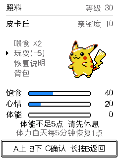
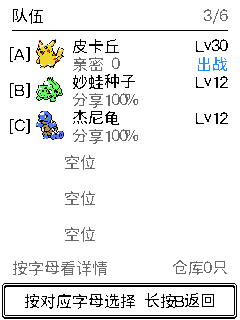
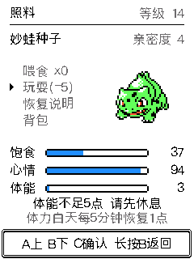

# 混合按键与照料体能修复 · 2026-09-10

按用户确认：玩耍需要完整的 5 点体能；喂食只消耗树果，体能为 0 也可以喂食。电源键调查暂停。

## 行为

- 不超过 3 个动作或列表项：画面标记 A/B/C，按对应键直接执行。列表按总项数判断，不按当前可见行数判断。
- 超过 3 项：A 上、B 下、C 确认。主页是 A 照料、B 菜单、C 遭遇；照料有 4–5 项，继续使用上下选择。
- 长按 B 0.6 秒返回，画面统一写「长按B返回」；战斗中先打开逃跑/认输确认。长按 C 1.5 秒熄屏。
- 捕获改为按下 A 立即投球、B 换球、C 返回；后续释放与 CLICK 不会重复投球。失败反击、自动战斗和存档重试流程保留。
- 队伍与仓库小列表增加字母标记，并为队伍小图留出空间。训练家大厅、换宠、探索活动等采用相同规则。
- `nurture_play` 和实际 `world_play` 在扣费前检查体能，不足时不改变心情、亲密度或存档状态；页面显示「体能不足5点 请先休息」，不播放成功反馈。停留照料页时体能恢复会更新画面。

## 验证

- [导航与局部重绘](evidence/hybrid-controls-2026-09-10/navigation.json)：10 组流程、750 次局部/全屏重绘比对通过，包含 0/4/5/6 点体能及队伍 3 项到 4 项的操作切换。
- [投球时机](evidence/hybrid-controls-2026-09-10/capture-timing.json)：306 组通过，覆盖可见命中区、区外投球和保存延迟。
- [世界与存档](evidence/hybrid-controls-2026-09-10/world-save.json)：45 个实际 C 用例及 6 项反向检查通过，包含不足 5 点的定点数边界、失败不写存档。
- [HTTP 同源输入](evidence/hybrid-controls-2026-09-10/http-input.json)：16 帧比对通过；Web 输入的 6 组事件检查通过，包含长按后不再发短按。
- 养成 Python/C 对照通过：3201 步自然变化、6 步混合流程、40 步照料操作。
- ESP-IDF 固件构建通过；浏览器实际操作确认 B 直达菜单、长按 B 返回主页。

## 设备安装

已备份完整 8 MB Flash，并在 `/dev/cu.usbmodem2101` 仅写入 `factory` 应用分区（`0x10000`），esptool 数据哈希校验通过。程序 2,993,472 字节；NVS、cardid、recovery 不在写入范围内。[安装记录](evidence/hybrid-controls-2026-09-10/hardware-install.json)。

[真机串口按键验证](evidence/hybrid-controls-2026-09-10/device-navigation.json)通过主页 A 照料、B 菜单，菜单 C 图鉴，以及长按 B 逐级返回。串口事件经过实际固件分发器；本次未要求用户再次手按测量物理时序。

烧录前后均为妙蛙种子 Lv14、经验 4489。设备当前体能 3 点，确认玩耍后正确显示「体能不足5点 请先休息」，体能、心情、亲密度均未增加或扣除。验证后已返回主页。

