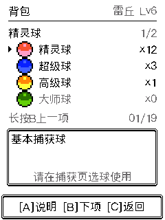

# 道具系统与静音烧录验收 · 2026-09-08

已完成道具系统，并将最终固件写入连接的 ESP32-C3。设备成功启动，照料和背包页面能够通过按键进出，最后停在 P1 待机页。原有 6 只队伍成员、5 种已捕获图鉴及队首雷丘 Lv6 均已读回。

## 玩法与入口

从「照料 → 背包」进入，沿用现有金银风格边框、像素字体和共享 C 渲染。A 使用道具或查看球类说明，B 下一项，长按 B 上一项，C 返回。球类在捕获页切换和使用。

| 类别 | 新库存内容 |
|---|---|
| 8 种球 | 精灵球、超级球、高级球、大师球、速度球、沉重球、等级球、友友球 |
| 5 种进化石 | 火之石、水之石、雷之石、叶之石、月之石 |
| 2 种机器 | 通讯机器、成长机器 |
| 4 种养成用品 | 树果、活力根、哞哞牛奶、开心饼干 |

石头覆盖第一代的 16 条石头进化路线，包括伊布的三种分支；通讯机器覆盖四种通讯进化。成长机器需达到原进化等级，可以跳过自然进化的亲密和探索要求；原有满足养成条件的自然升级进化仍免费。

养成道具分别补充饱食、心情、体能和亲密。照料页喂食现在消耗树果，玩耍和休息保留。无库存、不适用、没有正向收益或保存失败时，不消费道具。

战胜 1–5 星宝可梦的掉落率为 **25%、35%、45%、55%、65%**，即 `15% + 10% × 星级`。掉落时再按该星级权重抽取一种道具，精灵球一次 2–3 个，其余一次 1 个。高星更容易获得高级道具，大师球仅可能在五星掉落。每场只结算一次，无掉落也不会重抽；满额库存不会溢出。

八种球具有实际捕获差异：速度球看对方基础速度，沉重球看体重，等级球看双方等级；大师球保证命中，友友球提高捕获后的初始亲密。这些数值及机器、掉落、养成规则属于本项目设计。详细规则见 [道具核心验收](items-core-2026-09-08.md) 和 [S9 道具系统](../docs/systems/S9-items.md)。

## 存档与失败重试

存档升级为 V6，保留有效 V5 的原有数据。新游戏及旧档首次迁移获得 12 精灵球、3 超级球、1 高级球、2 树果、2 牛奶；写成 V6 后不会在每次启动重复补发。

使用道具和领取掉落均先保存候选状态，成功后才发布效果及库存。捕获分两次提交：投球时保存扣球和战斗状态，命中后保存收容结果。如果第二次保存失败，页面保留命中结果并提示「重试保存」，再次按 A 只重试收容，不再扣球，也不会误判为捕获失败、触发反击或逃跑。胜利后的最后一次捕获同样适用。

## 验证结果

- 实际 world/save/items C 代码：102 个场景、5 个故障变体，ASan/UBSan 通过；另有独立存储复核 5 组通过。覆盖旧档迁移、容量、进化、重复掉落、保存失败和并发状态合并。
- 50 万次掉落采样符合五档概率；八种球通过 266,760 项数值及边界检查。
- 实际 C 捕获与胜利页面：1,083 次局部重绘与全量重绘比对通过，覆盖八种球、正向掉落、无掉落、满额和两阶段保存失败。
- 背包和照料：19 种道具、5 页列表、10 组进化使用场景、4 种养成道具和失败反馈验证通过，366 次重绘比对一致。
- 浏览器实际 Canvas 的背包、喂食两帧与最终 C 渲染逐像素一致，每帧 76,800 像素。此结果针对所验收的帧，不等于所有页面和物理液晶显示已穷举验证。
- 静音路径 14 个场景和 5 个故障变体通过；已有开场选择、遭遇、战斗和捕获回归通过。最终固件、Inspector 均构建成功，源文件清单与最终产物一致，`git diff --check` 通过。

证据：[存档](evidence/items-2026-09-08/world-save.json)、[捕获与掉落](evidence/items-2026-09-08/capture-loot-flows.json)、[浏览器像素比对](evidence/items-2026-09-08/browser-parity.json)、[背包](evidence/bag-2026-09-08/verification.json)、[静音](evidence/silent-boot-2026-09-08/verification.json)。宿主测试替换了设备边界，真机检查范围见下文。

## 实际设备烧录

烧录前完成设备全量 8 MB 备份，文件保留在 `.device-backup/flash-before-items-silent-20260908.bin`。从该备份读取并确认当前 factory 分区为 3 MB，仅将主程序写入 `0x10000`；没有重刷 NVS、cardid、recovery、引导程序或分区表。

- 最终镜像：`firmware/build/PokeWalk.bin`，1,639,120 字节。
- SHA256：`5b3b0e3c3434f60676666a0c1bcbc3d07b13b5f4540ab83a84a42d64be393c7e`。
- 原生预览构建：`228718009b2f7897a4cd`。
- esptool 返回 `Hash of data verified.`，启动日志确认静音配置、UI 素材 6/6、队伍和图鉴读档成功，没有错误、panic 或 abort 日志。
- 真机依次进入照料、背包，再返回待机并保存。背包显示精灵球 12、超级球 3、高级球 1；此轮没有消费道具或改变队首。页面图通过串口读取设备 RGB565 帧缓冲，未使用物理相机。

设备检查与镜像记录：[hardware-install.json](evidence/items-2026-09-08/hardware-install.json)。备份哈希与实际分区表：[hardware-backup.json](evidence/items-2026-09-08/hardware-backup.json)。

## 本次声音设置

`CONFIG_POKEWALK_SILENT_BOOT=y` 在整个运行期禁用声音，重启后仍生效。开场、按键、战斗和后台音效均不会启动输出。启动先执行 codec 静音关闭，静音构建不创建音效任务，也不打开 I2S/codec 音频流；本板 PA 未接 MCU，没有使用虚构的 PA 控制引脚。

明天调声音时，取消此配置并同步修改 `sdkconfig.defaults`，重新构建和烧录即可恢复原有声音路径。本次没有播放音频，也没有安排自动恢复声音。验证包含源码路径和设备启动日志，未做声学测量或断电瞬态测量。
