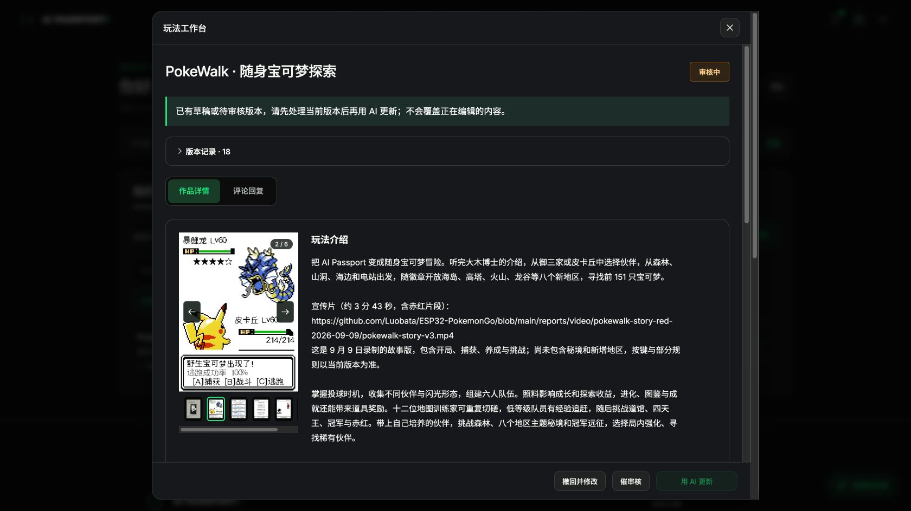

# 招式设置与仓库管理发布验证（2026-10-07）

## 本次内容

每个伙伴可单独关闭自动出招招式，默认全启用，至少保留一招；新学招式默认启用，策略跟随换位、入库和进化。仓库支持直接单只放生、默认取消的二次确认和等级升序。修复旧秘境记录占用 NVS 空间导致保存失败。未加入“无伤害招式”的软提醒。

[中文发布说明](../docs/release/2026-10-07-move-settings/changelog.zh.md) · [功能与真机验证](box-release-2026-10-07.md) · [招式验证](move-settings-2026-10-07.md)。

## 固件与检查

发布应用取自已烧录验证的源码 `4b614e7c8c90529f261fc9ca729774807b6f29e3`，3184576 字节，SHA-256 `c1fb6b84a8024fc6560c5c0c2cdeaa6d8b7c877c9d44d255eb021f22c8673636`。本轮再次执行全部发布检查及构建；发布时 HEAD 相对该源码只有测试、文档和官网变更，固件源码和素材相同。重新构建产生的版本元数据不同，未用其替换已经真机验证的发布应用。

完整包 3250112 字节，SHA-256 `a0d0f37b1fe1e423effbb828850700ed4b03284684fd57f0d724017e563bbfa9`。USB 更新 ZIP SHA-256 `1722b200ae808c7690c7c49ec16afbba54027dfe0e5a76734bd9e35aec330b82`。官方布局检查、本项目保护分区和官方 publisher 预览通过。

18 项脚本通过，覆盖 AGENTS.md 的 11 项存档/地区/栈检查、招式三项、仓库三项、发布分区保护；固件构建通过。攻略 398 个页面与链接、计算器及源数据摘要核对通过。构建中的 recovery 容量警告为既有布局：应用适配 factory，更新仅写 0x10000，不写 recovery。

## 存档边界

世界存档升级为 V21，支持 V5～V20 迁移及 V21 往返；23 个固定历史样例范围与固件一致。旧伙伴默认全启用招式，旧秘境兼容继续保留。启动、USB 暂存解码及真实 NVS 回归共用生产迁移逻辑；未知新格式、损坏及不匹配文件仍拒绝。开发 restore.py 仍限同设备同构建。

真机已完成应用保档升级、V20→V21 启动迁移、8 次保存及再次重启保存，原队伍/仓库、图鉴、道具、养成、挑战、探索和秘境保留。未在玩家唯一存档上覆盖导入；导入、故障回滚和旧键空间回收使用隔离真实 ESP-IDF NVS 测试。放生真机只查看并取消，成功删除和失败保护以隔离样例验证。

社区完整包包含 NVS 空白填充，不能视为保档更新。需先备份、安装后导入；分区匹配的现有设备可用应用更新 ZIP。游戏功能需要更新固件。在线及离线工具协议没有改动；刷新网页或重下离线 ZIP 可获得新版攻略，早期工具仍须更新。不能将 V21 导入不支持它的旧固件，也不承诺尚未实现的未来版本兼容。

## 发布状态

发布前确认项目 234 / pokewalk 的 REV-2170 已批准。沿用暴鲤龙封面、四张附图及原宣传片，五张本地上传图均已打开检查。本次社区 REV-2236 已提交审核，状态 pending，上一公开版本仍为 REV-2170。双语标题、介绍、使用说明、增量日志、源码和固件摘要回读一致。官方即时提交响应的 allowRemix 为 false，随后 projects 的真实项目状态为 true，公开源码地址保持原值。

## CI 差异修复

首次 GitHub 固件检查在测试驱动中被 GCC 的 misleading-indentation 告警阻止：for 后的独立断言写在同一行。已为循环补上括号并换行，保留全部断言与 -Werror，不修改游戏源码或降低检查要求。本地重新执行通过，重新提交 CI 验证。

补充在 devbox 的隔离源码副本中以系统 GCC 运行招式、秘境策略和仓库放生回归，全部通过。最初使用 Linuxbrew 混合工具链的尝试遇到宿主 GLIBC 链接冲突；改用 /usr/bin:/bin 后通过，未修改测试标准。隔离源码目录已清理，部署服务不受影响。

## 发布与部署结果

[GitHub Release v2026.10.07-move-settings](https://github.com/Luobata/ESP32-PokemonGo/releases/tag/v2026.10.07-move-settings) 已公开。所有附件的 GitHub digest 与本地相同；发布包应用与真机验证应用一致。源码、测试与说明已推送 main。

[固件 CI 37626038838](https://github.com/Luobata/ESP32-PokemonGo/actions/runs/37626038838) 全部成功（提交 16d45be），包含 Linux 完整游戏回归、ESP32 构建、真实 NVS 恢复和分区保护。[Pages CI 37625511037](https://github.com/Luobata/ESP32-PokemonGo/actions/runs/37625511037) 成功（提交 c572a5b）。随后只有测试修正及验证记录变更，官网源码不变。

GitHub Pages 和 devbox `http://10.37.197.13:8767/` 均已部署，各 10 个在线资源、12 个离线 ZIP 文件及 ZIP 本身与本地完全一致。浏览器核对新版仓库攻略入口和说明。更详细摘要见同名证据目录中的 github.json、firmware-ci.json、pages-ci.json、pages.json 和 devbox.json。

浏览器最终确认 REV-2236 工作台显示审核中，图库有 5 张图片与 1 个视频，首图仍为皮卡丘对战暴鲤龙。

