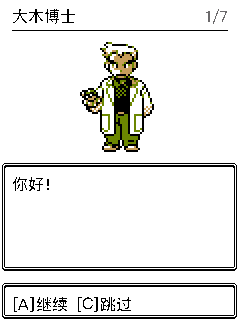

# 开场大木博士原版彩色修复

大木博士已改用固定 Crystal 提交 `7a7881d0d62e0ddbd82dcf10e7116807487ac651` 的完整 [oak.png](https://github.com/pret/pokecrystal/blob/7a7881d0d62e0ddbd82dcf10e7116807487ac651/gfx/trainers/oak.png)。[OakSpeech](https://github.com/pret/pokecrystal/blob/7a7881d0d62e0ddbd82dcf10e7116807487ac651/engine/menus/intro_menu.asm#L627) 选择 `POKEMON_PROF`，原版图指针与调色板表分别指向该图和 `oak.gbcpal`。

原生 56×56 完整整数放大至 112×112；移除了旧 RBY 图的内部白转浅灰处理。原版 RGB5 肤色 `(24,19,11)`、橄榄绿 `(13,16,0)` 与黑白转换为 RGB565 `[0000,6C20,C4EB,FFFF]`。普通 UIA1 格式、条目尺寸和页面布局保持原样。源白为色号 3，仍按页面白底的透明规则呈现。

`fetch_oak.py` 固定源提交与 PNG SHA-256；固件 `play_opening.c` 和 Inspector Oak 数据同步原配色。`verify_ui.py` 已替换旧灰度及洪泛断言，检查完整原图哈希、保留白像素与两端颜色一致。

验证通过：

- Pillow 独立解码源 PNG：3,136 个源像素与 UI 条目零差异；2,331 个源白像素全部保留。
- 编译固定上游 `tools/gbcpal.c`，得到的原配色与固件和 Inspector 一致。
- 实际七页同源 native 构建 `f9ee0c79a1bf99b90099` 的 P0：12,544 个 Oak 像素零差异，dirty/full redraw 零差异。
- 其余 8 个 UI 条目与改动前逐字节相同；故意把源白改成浅色的产物被门禁拒绝。

可复现生成与门禁：`python3 tools/pipeline/convert_ui.py`、`python3 tools/pipeline/verify_ui.py`。机器结果在 [result.json](evidence/oak-color-2026-09-07/result.json)，实际 C 页面截图如下。

