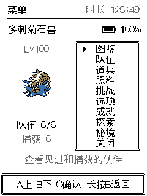
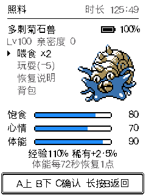

# 累计游戏时长（2026-10-06）

本轮实现已完成本地逻辑、页面及存档验证，尚未烧录、推送或发布。此前设备烧录的是 `074ee6b` 的探索平衡版，不包含本功能。构建结果另见本报告末尾的记录。

## 显示和计时

菜单与照料页右上角显示“时长 H:MM”，位于电量上方并右侧对齐。名称栏、电量位置和原有主体布局保留；照料页的等级移到亲密度一行。最大计数也能完整显示，不截断名字或挤占菜单。仅电量显示开关不影响时长显示和记录。

从可见游戏画面开始，所有页面共享一个累计计时器，包括战斗和动画。熄屏暂停、唤醒续计；关机时间和 Wi-Fi 校时补回的离线时长不计入。内部按秒保存、界面显示小时与分钟，跨小时不回绕。关闭电量时仍计时。旧档没有可靠的历史游戏时长，升级后从 0 开始，不用旧版开机时间猜算。

计时只使用本次开机的单调时钟。页间切换不清零，不到一秒的部分在熄屏/唤醒间保留；重启只恢复已保存的完整秒数。按既有五分钟定时存盘及关键事件保存，并在熄屏时额外存盘，不逐秒写 Flash。突然断电可能丢失最后一次成功存盘后的时长；正常熄屏会先保存。保存失败保留内存计数并走原有重试，不覆盖为 0。uint32 秒数饱和而不溢出。

## 存档与备份边界

- 世界存档由 V19 / 4016 字节升级为 V20 / 4024 字节；末尾新增 `playtime_s`，保留完整 V19 前缀及尾部填充。没有复用保留字节，也没有修改道具编号、NVS 键、分区或独立秘境 V4 布局。
- 支持 V5～V20：V5～V19 迁移保留原进度，时长明确为 0；V20 导出、导入和重启保留累计秒数。更老的 V19 固件不能读取 V20 存档，不能倒灌。
- 追加 `v20-dbc7945.bin` 和 manifest，已有 21 份历史样本及其摘要不变。历史样本检查世界和队伍进度，也核对时长默认值、V20 的 452967 秒及非零旧填充。
- 启动和 USB 导入共用生产解码与校验；同设备、分区、声明版本、数据长度/CRC/SHA、备份回读 ACK、设备覆盖确认、暂存日志、回滚和未知新版本拒绝均保留。命令行原始 Flash 恢复仍要求同构建。
- 生效需升级固件。在线网页和当前离线工具的动态版本协议通过 V20 检查；本轮没有更改网页资源或离线 ZIP，无需重新部署 Pages/devbox。早期固定版本限制的工具仍需要刷新或重新下载。
- 完整安装包可能覆盖 NVS，应先备份后安装/恢复；匹配分区的应用更新包只写应用。本轮没有安装或覆盖设备存档。

## 验证

- AGENTS.md 的 11 项存档/更新/地区/栈检查全部通过，另通过探索平衡与新计时检查。详见 [checks.json](evidence/playtime-2026-10-06/checks.json)。
- 新计时检查运行生产 world/save C 和 ASan/UBSan，验证运行、熄屏、重启、分数秒、关键事件保存、导出 checkpoint、写入失败、重试、旧填充及极值不回绕。
- 22 份历史样本通过启动迁移和真实 ESP-IDF NVS 引擎的导出、暂存、恢复、重启及回滚。该项运行在隔离 RAM Flash，未对真机玩家存档做覆盖导入。
- 71 项时长页面检查通过，覆盖两个页面、零值、分钟/小时边界、长数值、熄屏、跨页和关闭电量；整屏与分带像素一致，时长变化只影响标题右侧。电量原有多页面检查、95 项开关操作及硬件按键/熄屏逻辑回归通过。
- ESP32-C3 固件编译通过。源码、版本、应用摘要与构建结果见 [build.json](evidence/playtime-2026-10-06/build.json)。本轮未推送，因此没有新远端 CI；本轮未烧录，未进行真机计时或覆盖导入验收。
