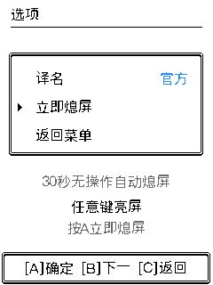

# 自动熄屏与独立电源键 · 2026-09-08

本轮新增 30 秒无操作自动熄屏，A/B/C 任一功能键亮屏，首次唤醒手势不进入游戏。菜单 → 选项增加「立即熄屏」，亮屏后保留原页面及选择位置。该选项和提示沿用现有金银风格边框、字体和居中规则。

## 独立电源键结论

[FoloToy 官方硬件指南 §3.2](https://github.com/FoloToy/ai-passport/blob/main/docs/hardware-design/AI_HARDWARE_DEVELOPMENT_GUIDE.md#32-product-interfaces-outside-the-bsp) 明确区分独立电源键与三枚 ADC 功能键：独立键控制硬件供电。当前公开 BSP、引脚表和硬件资料没有电源键短按事件、MCU 连线或可读取寄存器。因此本轮未绑定该键，不能承诺单靠现有固件实现短按熄屏；需要厂家原理图或电源键接口说明进一步确认。原来的硬件长按关机行为未修改。

## 运行行为

- 关闭 GPIO21 的背光 PWM，并停止游戏画面向 LCD 的 SPI 推送；后台 Wi-Fi 扫描、遭遇队列和养成时钟继续运行。
- 这是显示熄屏，未启用 ESP32 的 light/deep sleep，未承诺整机待机电流或续航天数。
- 唤醒先在暗屏状态重画完整当前页，再点亮背光。短按、双击、三连按及长按的整组唤醒事件都会被消费，避免误投球或退出玩法。
- 通过按键库的真实 `BUTTON_PRESS_END` 收尾；不依赖猜测双击时间窗。若获取 LVGL 锁超时丢失释放或结束事件，由原子清理邮箱在后续持锁阶段恢复，防止输入状态残留。
- 战斗出场、招式、反击、逃跑反馈、经验动画、进化和其他有限过场完成前保持亮屏，结束后再计 30 秒。等待选择、等待投球和静态保存重试页面可以熄屏。
- 首次亮屏保持原游戏状态；未改变队伍、道具、存档结构或已有静音设置。

## 验证

最终原生构建：`0da97b4a8a1841f5ddd8`。

| 范围 | 结果 |
|---|---|
| 输入链 | 生产 screen_idle/BSP、实际 ADC/按键库，以及原 main/nav 分发：40 场景、9 个负向检查，ASan/UBSan 通过 |
| BSP 事件 | 三键 PRESS/RELEASE/CLICK/DOUBLE/LONG/END 顺序，6 类错误恢复、7 个负向检查通过 |
| 页面保护 | 17 场景、1243 次局部/全量重绘一致；覆盖 34.14 秒战斗保亮、经验/进化动画、捕获等待及醒屏不扣球 |
| 菜单 | 最终构建 6 条文字像素比对、20 次重绘一致；立即熄屏、首次 A 仅亮屏、光标保留 |
| HTTP | 最终构建 11 帧与原生 C 完全一致，包含 29999/30000 ms 边界、全黑画面及醒屏语义 |
| 浏览器 | 在 `06a48183e33c9fdbf2d8` 中实点选项 → 立即熄屏 → A 亮屏，确认全黑、状态提示与原菜单选择恢复；后续仅补锁超时清理 |
| 既有回归 | 队伍 519 次检查、通用渲染 1115 次检查、65536 种 RGB565 转换及 Web 输入/时钟负向检查通过，原始日志保留执行阶段版本 |

证据：[输入](evidence/screen-idle-2026-09-08/input.json)、[页面](evidence/screen-idle-2026-09-08/pages.json)、[菜单](evidence/screen-idle-2026-09-08/menu.json)、[HTTP](evidence/screen-idle-2026-09-08/http.json)、[真机](evidence/screen-idle-2026-09-08/device.json)。

## 硬件更新

更新前备份了设备的 NVS、相邻配置区及已安装程序。备份中程序 SHA256 与上次安装记录逐字节吻合；此前完整 8 MB 备份仍保留。详见 [备份记录](evidence/screen-idle-2026-09-08/hardware-backup.json)。

最终镜像 **1,650,272 字节**，SHA256 `7b169a301cb2caea9ef000041aa7e1df6d4403280b4d91be6a44432869b47459`，仅写入 `0x10000` 主程序分区。烧录已返回 `Hash of data verified.`。`CONFIG_POKEWALK_SILENT_BOOT=y` 持续启用。

真机验收读取背光 PWM 配置和后台扫描计数，使用串口语义按键验证菜单及唤醒；物理手指长按、电流与续航未实测。记录见 [安装结果](evidence/screen-idle-2026-09-08/hardware-install.json)。
