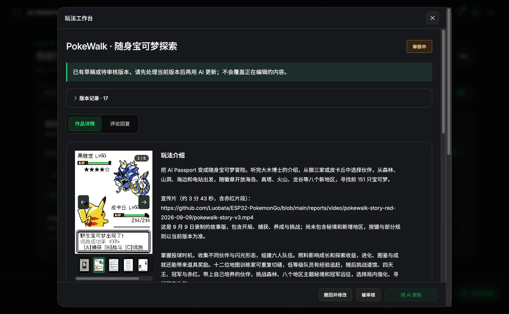

# 2026-10-07 闪光出场与怀旧招式译名发布

## 交付

- 游戏源码 `af22e73947c5a2b4693ea89fd671995c2a1159d9` 已推送 main。官网源码 `34ff7493a367c3d57ae7dc789ad3014127d990d5` 仅更新攻略与导出器，发布固件仍来自前一提交。
- [GitHub Release v2026.10.07-shiny-names](https://github.com/Luobata/ESP32-PokemonGo/releases/tag/v2026.10.07-shiny-names) 已公开，完整安装包、USB 保档更新包和 manifest 的服务端 SHA-256 与本地逐项一致。
- 社区项目 **234 / pokewalk** 的 **REV-2170** 已提交审核，回读状态 `pending`，尚未公开；上一公开版本 REV-2158 已通过审核。双语标题、介绍、使用说明、增量日志和固件摘要与上传内容一致。
- 浏览器确认「审核中」、五张图片和独立宣传视频。第一张仍为用户指定的皮卡丘对战暴鲤龙，上传前已逐张查看原四张附图；未声称逐字节回读待审图片。保留既有宣传片及其 9 月 9 日录制说明。
- [官网更新说明](https://luobata.github.io/ESP32-PokemonGo/guide/#updates) 已同步 Pages 和 devbox，攻略固定本次游戏源码；10 个网页资源和离线 ZIP 的 12 个文件均与本地相同。封面未变，存档协议未改。

## 游戏改动

闪光伙伴在出场动作后追加反色、八向星光和既有音效。野生、训练家及秘境共用；只对真实换入的一方播放，双方闪光按序展示，静音有效。原图与帧序列按固定金银源码提取，角色坐标按本机画面适配，并非完整原机音画模拟。

同一个「菜单 → 选项 → 译名 → 怀旧」开关联动物种与当前 191 个招式，161 个显示名变化、30 个原本同名。战斗文字、技能列表、学招提示和后台验收页同步切换。招式数据、ID、伤害、AI、学习规则不变；词表依据历史资料整理，未宣称汉化 ROM 逐字节一致。

## 存档与真机

未改 save.h/save.c、持久化结构、编号、NVS 键、分区或迁移边界。世界存档仍为 V20，V5～V19 迁移和 V20 往返保留，秘境 V3→V4 保留。固定历史样本未改。2026-10-06 公开版本和本次格式/布局相同，跨构建兼容由实际解码与校验判断，不以构建哈希拒绝。开发命令 restore.py 仍限同设备同构建。

使用本次实际发布的 PokeWalk-update.zip 烧录连接设备，仅写 0x10000 应用。先手动保存并在私人目录备份数据、写盘回读，应用写入验证和受保护区域逐字节核对均成功，随后重启验证：妙蛙花 Lv40 / 102416 经验，图鉴 103/151，队伍 6、总伙伴 96，秘境 run1/node4/phase6 与升级前相同。静音保持，升级后手动保存成功，无 panic。私有数据仅在 `.device-backup/shiny-names-20261007/`，未入库或上传。

本轮真机验证为保档更新和启动读档，**没有覆盖导入玩家唯一存档**；USB 导入、断电/回滚和旧档迁移通过隔离环境的生产代码及真实 ESP-IDF NVS 自动化验证。社区蓝牙完整安装未实测。

用户获取游戏新效果必须升级固件，单独刷新网页不足。当前存档网页/离线工具无兼容协议变化，刷新/重新下载可获得新攻略；旧工具仍建议更新。完整 full.bin 的空白区域会覆盖 NVS，社区完整安装必须先保存 .pksave、安装后恢复；已有布局匹配设备可使用保档更新 ZIP。不可把新格式倒灌给不支持它的旧固件。

## 校验与摘要

AGENTS.md 的全部 11 项存档、导入、分发、分区更新、地区和秘境栈检查，以及 tools/device/fw.sh build 通过。发布包上游格式、本项目分区保护和应用内容一致性校验通过。闪光出场 1124 次帧检查、招式 1528 组同种子对照和 905 次重绘检查、战斗呈现 4738 样本通过。

[发布源码固件 CI](https://github.com/Luobata/ESP32-PokemonGo/actions/runs/37501042787) 全部通过；[Pages CI](https://github.com/Luobata/ESP32-PokemonGo/actions/runs/37501972322) 通过。两个额外旧 UI 脚本的基线失败情况见闪光实现报告，本次未将其计为通过。

- 应用：3177616 字节，`aeeb30fef549098b2f9260dade5faa2bf44d827debaf3f188c7b6b941a75a72c`。
- full.bin：3243152 字节，`5419cfd77bded4e94ebd7a3c48506925beb811feef5fef61e423139f60bf998a`。
- USB ZIP：`5fe169b9e1c8aedc4d57f8537cde8142bf12c940ab9fa4abd7db2447da42ad52`。
- 构建版本 `v2026.10.06-exploration-5-gaf22e73`；应用描述符只有 31 个可见字符，设备显示截为 `v2026.10.06-exploration-5-gaf22`。烧录使用完整应用摘要校验，未仅凭该缩略字符串认定版本。

[产物](evidence/shiny-names-release-2026-10-07/build.json) · [真机](evidence/shiny-names-release-2026-10-07/device.json) · [检查](evidence/shiny-names-release-2026-10-07/checks.json) · [社区回执](evidence/shiny-names-release-2026-10-07/community.json) · [GitHub 回执](evidence/shiny-names-release-2026-10-07/github.json) · [Pages](evidence/shiny-names-release-2026-10-07/pages.json) · [devbox](evidence/shiny-names-release-2026-10-07/devbox.json)。

