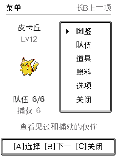
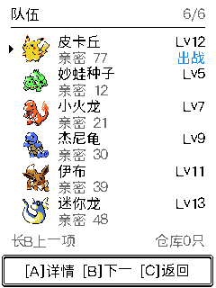

# 菜单、队伍与长按修复 · 2026-09-08

待机 B 已由「图鉴」改为「菜单」，入口包含图鉴、队伍、道具、照料、选项和关闭。保留 A 照料、C 遭遇的快捷操作。菜单采用金银时期的右侧边框列表，参考 [Crystal Start 菜单结构](https://github.com/pret/pokecrystal/blob/master/engine/menus/start_menu.asm)，沿用现有固件的字体、光标、边框和 RGB565 渲染。

## 队伍操作

六人列表显示正面缩略图、全名、等级、亲密和出战标记。B 下一名，长按 B 上一名，A 查看详情。在详情中，A 设为出战伙伴，B 打开道具，C 回到列表；非首位成员需先明确设为出战，避免打开背包时暗中换人。道具、成员详情、队伍和主菜单逐级返回，并保留原来的选择位置。

首位负责跟随、照料和出战。换首保留每只宝可梦的等级、经验、亲密、探索和闪光标记，更新后续战斗的初始化数据。保存失败时仍保持原队伍，页面提示重试；活动战斗禁止换首。同种但等级不同的两名成员也不会选错。

本轮直接启用现有六人队伍数据，不升级 V6 存档版本，也无需清档；既有 V5 读档仍沿用原来的升级处理。超过六人的捕获继续按既有规则进入仓库，队伍页显示仓库数量；仓库与队伍交换界面尚未加入。饱食、心情、体能继续采用已有共享状态，换首不会刷新或清除战败惩罚；亲密和探索属于各成员。成员存档的亲密为整数，换下时舍弃不足 1 点的小数，连续往返不会刷高亲密。

同时修复了闪光队首在待机、照料和战斗中使用普通配色的问题。详情、菜单与这三页现在一致读取成员标记。

真机读档还发现旧捕获成员存在 Lv12、EXP=0 的记录。现已对合法旧档的全部随行和仓库成员补齐当前等级的经验起点，只增加不足部分，不改等级、不减少已有经验；启动即保存，保存失败保留原磁盘并等待重试。新捕获成员同时初始化累计经验，获得奖励也增加下限和溢出保护。实际存档验证新增 15 个场景和 6 个故障变体，页面验证确认比比鸟 Lv12 从 0 补到 4320，战胜后继续增长而不掉级。

## 长按 B

网页原来只有点击监听，实际按住后松手仍发送单击。现在默认手势会识别鼠标、触屏和键盘 A/B 的 600 ms 长按，每次按住只触发一次，松手不补发单击。取消、失焦和页面隐藏会清理未完成输入；下拉选项仍支持显式注入手势。

硬件端另复现了底层按键库的两个问题：持续按住的 START 回调越界，以及短点后立即再按住时不产生长按。BSP 采用独立的一次计时器，按下计时、释放取消，到点复查电平后才发长按。A/B 约 0.6 秒，C 退出玩法保留 1.5 秒；未修改托管依赖库。

## 验证

| 范围 | 结果 |
|---|---|
| 实际 world/save 队伍事务 | 27 个场景、6 个故障变体通过；包含保存失败、重启读档、并发状态合并和重复物种 |
| 实际菜单/队伍/导航页面 | 519 次局部与全量重绘一致，包含六人、单人、满队后仓库计数、换首失败重试、返回链、闪光队首与后续战斗 |
| 独立交互复核 | 同种不同等级成员、道具作用对象、换首重试；102 次重绘一致 |
| 151 种图像与名字 | 每种检查「官方名＋普通配色」及「怀旧名＋闪光配色」两组，共 302 个场景；906 次原资产像素比对、302 次完整名字检查、906 次重绘全部通过；名字距 Lv100 至少 45 px |
| 按键 BSP 与真实库 | ASan/UBSan 通过；三键单/双/长按、短点后接长按、阈值边界、换键、6 类错误恢复与 5 个故障变体；事件回放到实际 P10 后正确上一项，释放不抵消 |
| Web JavaScript | 7 组手势检查、4 个故障变体；原有 13 组时钟/队列检查和 5 个故障变体通过 |
| 浏览器实际交互 | 最新构建中鼠标按住 B 750 ms：背包第 2 项回到第 1 项，队伍第 1 名回到第 6 名，松手均不补发单击；待机 → 菜单 → 队伍 → 菜单通过 |
| 本地预览 HTTP | P10/P11/P12 的 13 帧与原生 C 返回像素完全一致 |
| 既有功能 | 102 项道具事务、背包、捕获与掉落、1115 次通用页面重绘及静音路径回归通过 |

原生预览构建为 `40fb517ab012dd3a66c1`。最终 ESP-IDF 和 Inspector 构建均成功，生成清单匹配当前源码。

519 次页面流程、旧捕获经验保护、道具捕获流程及 HTTP/浏览器检查使用最终构建。布局 906 次和独立交互 102 次使用此前的 `06fd9c5e4007d1153b88`；通用页面 1115 次使用 `cba33b0684b56d17b05b`，记录见 [通用渲染回归](evidence/team-menu-2026-09-08/preview-regression.log)。各项证据保留执行时的构建版本，最终经验保护另有针对性回归。按键 BSP 的最终源码指纹与已通过 ASan/UBSan 的版本一致。

证据：[队伍事务](evidence/party-2026-09-08/world-save.json)、[旧捕获经验保护](evidence/party-2026-09-08/legacy-exp.json)、[页面流程](evidence/team-menu-2026-09-08/ui-flows.json)、[图像布局](evidence/menu-party-2026-09-08/layout.json)、[按键](button-input-2026-09-08.md)、[HTTP](evidence/team-menu-2026-09-08/http-preview.json)。

Web 手势验证运行生产 JavaScript 的测试环境，HTTP 检查运行真实本地服务。桌面恢复可用后，已在内置浏览器重载最终构建并实测鼠标长按；记录见 [浏览器交互](evidence/team-menu-2026-09-08/browser-interaction.json)。键盘与触屏手势通过 JavaScript 自动测试，未在本轮浏览器实测。硬件按键时序通过真实 BSP/库与模拟 ADC 检查，未测量实体按键电压噪声和实际手指按住时序。真机显示读取的是设备帧缓冲，非相机照片。

## 静音硬件更新

本次完整 8 MB 备份保留在 `.device-backup/flash-before-team-menu-silent-20260908.bin`，分区表已与构建逐字节核对。最终镜像只写入 factory 主程序分区 `0x10000`，未重刷 NVS、cardid、recovery、引导程序和分区表。

最终固件大小 **1,647,472 字节**，SHA256：`fb7bdc34d5464b9a1566d2e6e2d203313d048d09b5d08046a655a3bf26e01cc4`。烧录返回 `Hash of data verified.`，启动日志确认原有 6 名成员、5 种捕获图鉴和队首雷丘 Lv6 正常读回。

真机启动修复并立即保存了 5 名成员的经验。比比鸟详情显示 Lv12 / EXP 4320，设为出战成功；随后恢复雷丘 Lv6 为队首及原队伍顺序。检查过程未消耗道具。再次重启仍静音、保留雷丘 Lv6，且不再重复修复旧成员，确认修复已持久保存。

`CONFIG_POKEWALK_SILENT_BOOT=y` 保持启用，开场、按键、战斗和后台声音均禁用，重启仍静音。没有设置自动恢复声音。

真机检查结果及最终停留页面见 [硬件验收记录](evidence/team-menu-2026-09-08/hardware-install.json)。
