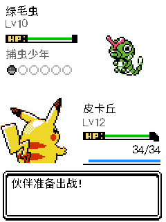
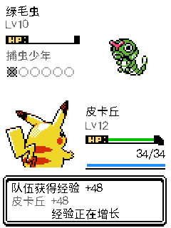
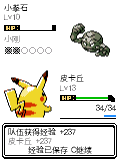

# 训练家与道馆经验条、结算反馈

用户确认问题出现在训练家／道馆战斗界面。该界面独立于野生战斗的绘制代码：此前未调用经验条绘制，战后直接进入训练家对话，没有经验增长动画，获得经验数字只在奖励流程的最后一屏展示。

经验发放没有删除。设备更新前读回为妙蛙种子 Lv15、经验 5748，较上一版验证记录的 5620 增加 128。实际 world/save 的经验结算路径保留，本次修复展示与操作反馈。

## 改动

- 训练家战斗我方 HUD 使用野战同一套金银风格经验条。HP 数值移到 y208，经验条放在 y224–239，与 y240 开始的消息框分开；换宠后使用当前出场成员的经验，满级显示满条。
- 战后先提交经验与奖励，再播放经验增长动画，数值分别展示队伍合计和当前伙伴的增量。约 1.62 秒增长、1.08 秒停留，之后自动进入人物对话；增长完成后可按 C 继续。
- 新增的是展示阶段，不重新执行经验发放。动画途中确认或返回不跳过增长，也不传递到下一屏。保存失败先显示错误，C 重试成功后才播放动画。
- 胜利与败战获得经验时都展示；认输和全队满级实际增量为零时不虚构经验增长。等级跨越时播放现有升级音效，遵守静音设置。
- 保留人物对话、道具奖励、徽章与六名队员的升级学招提示顺序。学习提示等待经验动画及奖励流程结束。

## 验证

- [经验 UI 专项](evidence/trainer-exp-2026-09-10/trainer-exp-ui.json)：580 次局部／全屏像素比对，覆盖切磋胜利、道馆保存失败重试、败战、我方倒下换宠。实际增量分别为 110、237、33、906，逐帧检查不重复发放、经验条确实变化，以及对话／奖励先于学招提示。
- [既有升级提示回归](evidence/trainer-exp-2026-09-10/growth/growth-ui.json)：165 次像素比对，主页经验条、五招分页、六名队员提示和关闭时输入隔离通过。
- [体能回归](evidence/trainer-exp-2026-09-10/stamina/ui.json)：298 次像素比对，入场扣费、保存失败回滚、败战心情、联盟后续免费和待机恢复通过。
- ESP-IDF 5.5.3 构建通过。存档仍为 V14 / 3664 字节，没有更改经验公式或奖励数量。

## 安装与设备读回

已备份设备数据及应用 `0x9000..0x310000`，仅将应用烧录到 `0x10000`，esptool 哈希验证通过，保留 NVS/cardid/recovery。应用 2,997,760 字节，SHA256 `9db84ecb780cdb96467f2ed372c5aa5cd2fe247aa309f32495cbb3fdfae96a95`；[安装记录](evidence/trainer-exp-2026-09-10/hardware-install.json)。

设备启动与导航检查通过，更新前后主宠仍为妙蛙种子 Lv15、经验 5748，未注入测试经验或消费挑战体能。战斗经验动画与重试在同源 C 隔离场景验证；设备已返回主页。[设备检查](evidence/trainer-exp-2026-09-10/device-navigation.json)。网页已刷新到构建 `8c8d727c68678fa6fb85`，检查了实际浏览器中的 P13 战斗 HUD。
